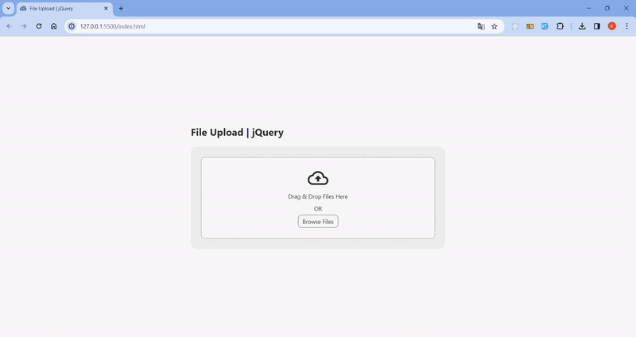

# <h1 align="center">jQuery - File Upload Plugin 📤</h1> 

<p align="center">It is a simple jQuery plugin that allows file uploading, viewing and deleting operations.</p>



## 💎 Features

<ul>
  <li>📂 Files can be uploaded by selecting or drag and drop</li>
  <li>📅 The name, image preview, size and type of uploaded files are listed in a table</li>
  <li>🗑 Uploaded files can be deleted</li>
</ul>

## 📋 Instruction

Clone this repository.

```shell
git clone https://github.com/kaderbrl/file-upload-jQuery.git
```

Usage:

```html
<div id="fileUpload"></div>
```

```javascript
$(document).ready(function () {
    $("#fileUpload").fileUpload();
});
```

## 💻 Live Demo

Check the live demo here 👉 [Demo](https://kaderbrl.github.io/file-upload-jQuery/) 

## Languages and Tools

<div align="left">
  
  
  
  
  
</div>
